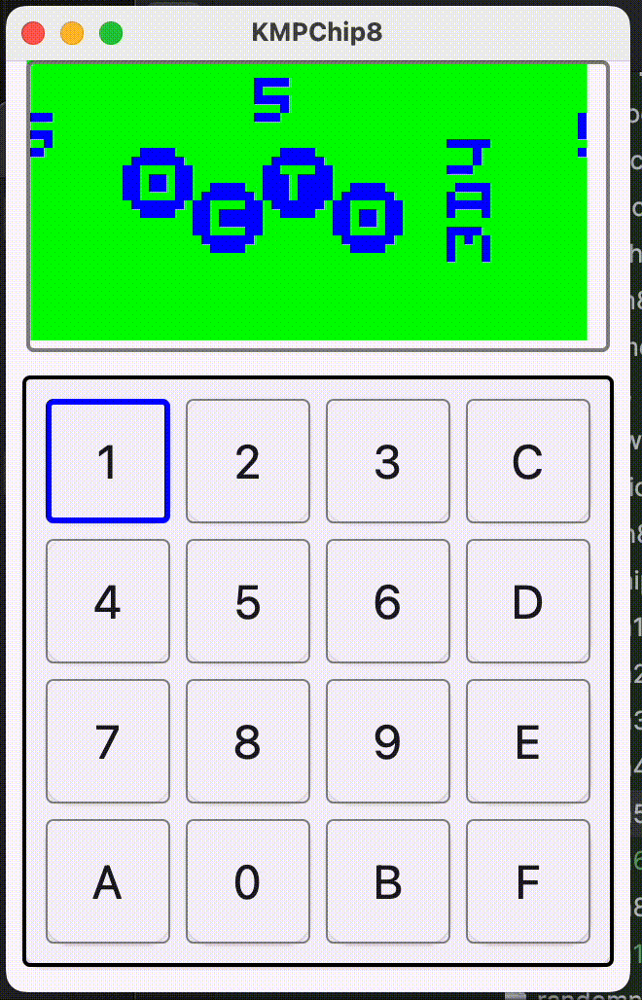
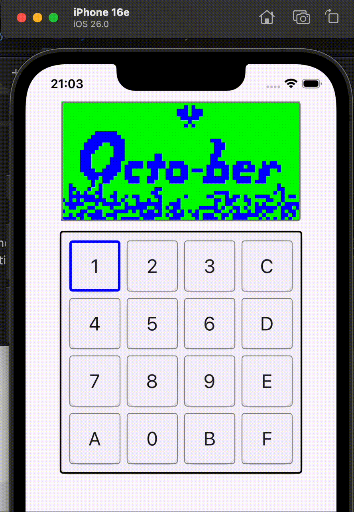
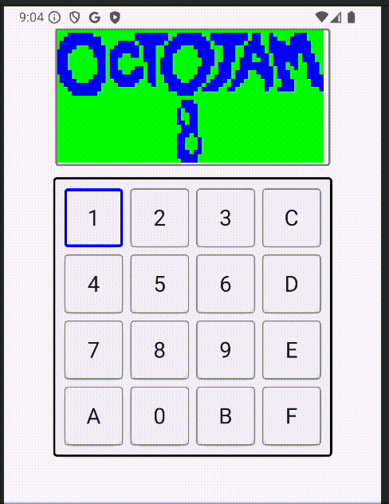

## KMP CHIP-8 Emulator

Proof of concept chip-8 emulator which runs on iOS/android/wasm/desktop using Kotlin Multiplatform.

### JVM

### iOS

### Android

### Webassembly

### TODO
- Implement sound
- Nicer key input handling
- Allow system tuning at runtime
